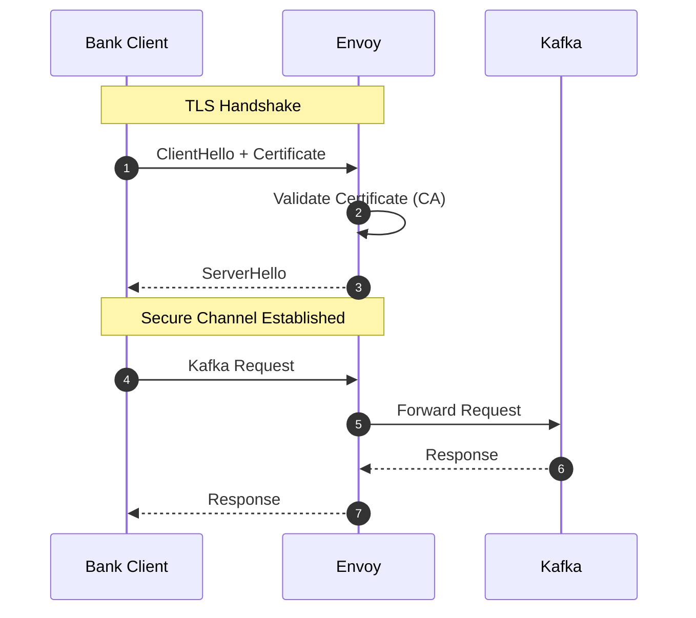
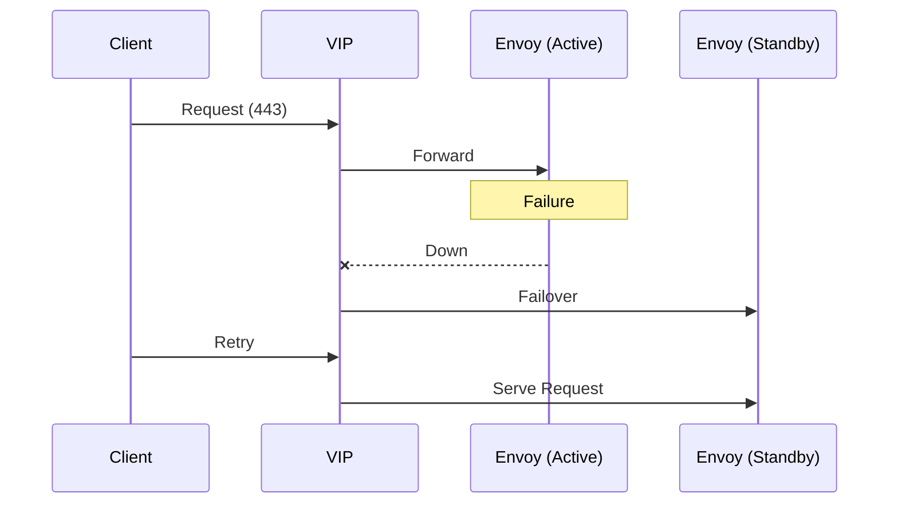

# 🚀 Kafka KRaft + Envoy Platform

### Secure Single-Endpoint Kafka (mTLS + HA) — Ubuntu 22/24


---

## 📑 Table of Contents

* [Overview](#-overview)
* [Architecture](#-architecture)
* [Security (mTLS Flow)](#-security-mtls-flow)
* [High Availability](#-high-availability)
* [Repository Structure](#-repository-structure)
* [Prerequisites](#-prerequisites)
* [Configuration](#-configuration)
* [Deployment](#-deployment)
* [Access](#-access)
* [Observability](#-observability)
* [Runbooks](#-runbooks)
* [CI/CD](#-cicd)
* [Scaling](#-scaling)
* [Design Summary](#-design-summary)
* [Roadmap](#-roadmap)

---

## 🚀 Overview

This platform enables **secure Kafka exposure to external banks** via:

* 🔐 **Single endpoint (`:443`)**
* 🔑 **Mutual TLS authentication**
* 🧠 **Kafka-aware proxy (Envoy)**
* ⚡ **KRaft mode (no Zookeeper)**
* 🔁 **High availability (VIP failover)**
* ⚙️ **One-command deployment (Ansible)**

---

## 🧱 Architecture

```mermaid
flowchart LR
    Bank[Bank Client] -->|mTLS 443| VIP["kafka.bank.example.com - VIP"]
    VIP --> E1[Envoy Node 1]
    VIP --> E2[Envoy Node 2]

    E1 --> K1[Kafka Broker 1]
    E1 --> K2[Kafka Broker 2]
    E1 --> K3[Kafka Broker 3]

    E2 --> K1
    E2 --> K2
    E2 --> K3

    subgraph Kafka Cluster (KRaft)
        K1
        K2
        K3
    end
```

### 💡 Key Principles

* Single public endpoint
* Brokers remain private
* Envoy handles Kafka protocol routing + metadata rewriting
* Clients are decoupled from broker topology

---

## 🔐 Security (mTLS Flow)



### 🔒 Security Controls

* mTLS enforced (client cert mandatory)
* No direct broker exposure
* CA-based trust model
* Optional: IP allowlisting, rate limiting

---

## 🔁 High Availability



### ⚙️ Behavior

* Keepalived manages VIP
* Automatic failover
* Zero client disruption

---

## 📁 Repository Structure

```text
kafka-kraft-envoy-platform/
├── inventories/
├── playbooks/
├── roles/
├── templates/
├── scripts/
├── .github/workflows/
├── ansible.cfg
└── README.md
```

---

## ⚙️ Prerequisites

### Control Node

```bash
sudo apt update
sudo apt install -y ansible git python3-pip openssl
```

### Target Nodes

* Ubuntu 22.04 / 24.04
* SSH access configured
* Open ports:

  * 9092 (Kafka internal)
  * 9093 (Controller)
  * 443 (Envoy)
* NTP enabled

---

## 🔧 Configuration

### 1. Update Inventory

```bash
nano inventories/prod/hosts.ini
```

---

### 2. Generate Cluster ID

```bash
/opt/kafka/bin/kafka-storage.sh random-uuid
```

Update:

```yaml
cluster_id: "<UUID>"
```

---

### 3. TLS Setup

* Internal CA generated automatically
* Replace with enterprise CA if required

---

## 🚀 Deployment

```bash
ansible-playbook -i inventories/prod/hosts.ini playbooks/site.yml
```

---

## 🌐 Access

```text
kafka.bank.example.com:443
```

Client config:

```properties
bootstrap.servers=kafka.bank.example.com:443
security.protocol=SSL
```

---

## 📊 Observability

* Kafka → JMX exporter
* Envoy → `:9901/stats`
* Integrates with:

  * Prometheus
  * Grafana

---

## 🚨 Runbooks

### Kafka Down

```bash
systemctl restart kafka
```

### Envoy Down

```bash
systemctl restart envoy
```

### TLS Issue

```bash
openssl s_client -connect kafka.bank.example.com:443
```

---

## 🔁 CI/CD

```text
.github/workflows/deploy.yml
```

* Automated deployment
* Extendable to multi-env pipelines

---

## 📈 Scaling

* Add broker → update inventory → re-run playbook
* No client changes required

---

## 🧭 Design Summary

| Capability      | Implementation |
| --------------- | -------------- |
| Single Endpoint | Envoy          |
| Security        | mTLS           |
| HA              | Keepalived     |
| Kafka Mode      | KRaft          |
| Automation      | Ansible        |

---

## 🚀 Roadmap

* Vault-based certificates
* Terraform provisioning
* Multi-region Kafka
* Blue/green upgrades

---

## 📄 License

Internal / Enterprise Use

---

