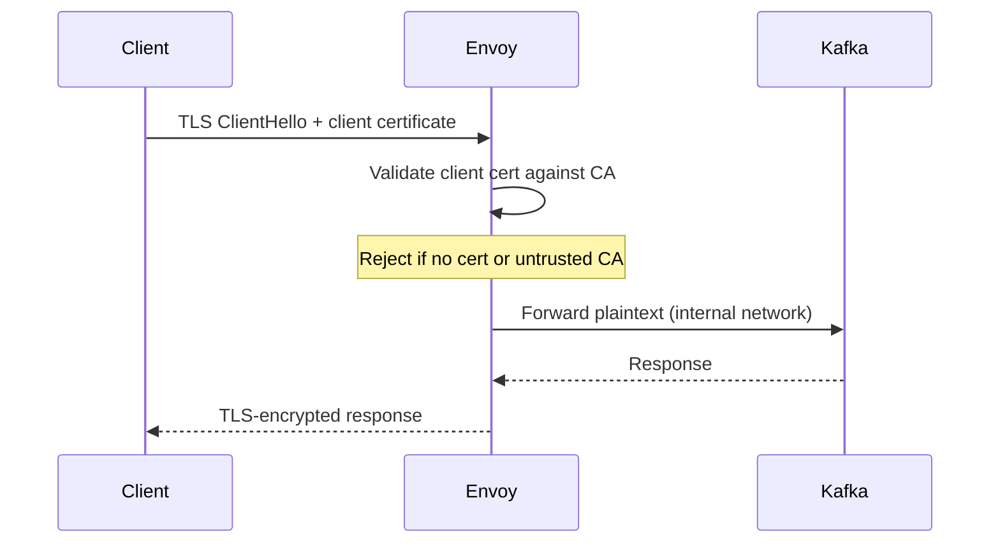
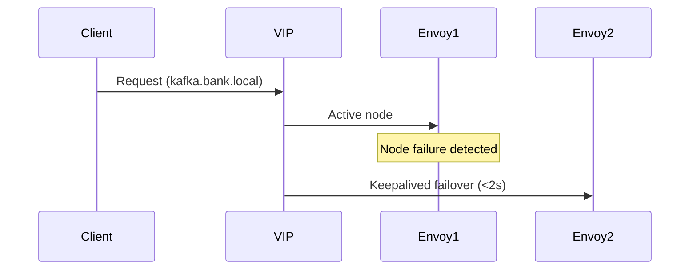

# Kafka KRaft + Envoy Platform

### Secure Single-Endpoint Kafka (mTLS + HA + Monitoring) — Bare Metal (Ubuntu 22/24)


---

## Table of Contents

* [Overview](#overview)
* [Component Versions](#component-versions)
* [Architecture](#architecture)
* [Security](#security-mtls-flow)
* [Monitoring](#monitoring)
* [High Availability](#high-availability)
* [Bare-Metal Deployment](#bare-metal-deployment)
* [Local Development (Docker Compose)](#local-development-docker-compose)
* [Installation Guides](#installation-guides)
* [Operations Runbook](#operations-runbook)
* [Deployment](#deployment)
* [Validation](#validation)
* [CI/CD](#cicd)
* [Testing](#testing)
* [Scaling](#scaling)
* [Design Summary](#design-summary)

---

## Overview

This platform provides a **production-grade Kafka ingestion layer** with full observability:

* Single endpoint (`:443` / `:19092-19094` via Envoy)
* mTLS authentication — client certificates required
* Envoy Kafka protocol-aware proxy with per-broker routing
* KRaft mode (no ZooKeeper) — 3-node cluster with combined broker+controller roles
* Full monitoring stack: Prometheus metrics, Grafana dashboards, Kafka-native exporter
* Keepalived VIP failover for bare-metal HA
* Fully on-prem, bare-metal deployment via Ansible

---

## Component Versions

All components are **latest stable open-source** releases:

| Component | Version | License | Role |
|---|---|---|---|
| [apache/kafka](https://kafka.apache.org/) | 3.9.0 | Apache-2.0 | 3-node KRaft broker+controller cluster |
| [envoyproxy/envoy-contrib](https://www.envoyproxy.io/) | v1.33 | Apache-2.0 | mTLS termination, per-broker TCP proxy |
| [danielqsj/kafka-exporter](https://github.com/danielqsj/kafka_exporter) | v1.9.0 | Apache-2.0 | Kafka protocol metrics for Prometheus |
| [prom/prometheus](https://prometheus.io/) | v3.2.1 | Apache-2.0 | Metrics collection and alerting |
| [grafana/grafana](https://grafana.com/) | 11.5.0 | AGPL-3.0 | Observability dashboards |

---

## Architecture

```
                         ┌─────────────────────────────────────────────────────┐
                         │                  Docker / Bare Metal                │
                         │                                                     │
  Kafka Client           │   ┌──────────────────────────────────┐              │
  (mTLS + client cert)   │   │           Envoy v1.33            │              │
  ──────────────────► :19092 │  - mTLS termination              │──► kafka1:9094
                         │   │  - Per-broker TCP routing        │──► kafka2:9094
                         │  :19093  - Kafka protocol filter      │──► kafka3:9094
                         │  :19094  - Admin API :9901            │              │
                         │   └──────────────────────────────────┘              │
                         │                   │ plaintext                       │
                         │                   ▼                                 │
                         │   ┌──────────────────────────────────┐              │
                         │   │     Kafka KRaft 3.9.0 Cluster    │              │
                         │   │  kafka1 (broker+controller) :9092│              │
                         │   │  kafka2 (broker+controller) :9092│              │
                         │   │  kafka3 (broker+controller) :9092│              │
                         │   └──────────────────────────────────┘              │
                         │          │ internal plaintext                       │
                         │          ▼                                          │
                         │   ┌─────────────────┐   ┌──────────────────────┐   │
                         │   │ kafka-exporter  │   │      Prometheus      │   │
                         │   │   v1.9.0 :9308  │──►│      v3.2.1 :9090    │   │
                         │   └─────────────────┘   └──────────┬───────────┘   │
                         │                                     │               │
                         │                                     ▼               │
                         │                          ┌──────────────────────┐   │
                         │                          │    Grafana 11.5.0    │   │
                         │                          │        :3000         │   │
                         │                          └──────────────────────┘   │
                         └─────────────────────────────────────────────────────┘
```

### Listener Layout

| Listener | Protocol | Purpose |
|---|---|---|
| `kafka1/2/3:9092` | PLAINTEXT | Internal broker-to-broker + exporter |
| `kafka1/2/3:9093` | PLAINTEXT | KRaft controller quorum |
| `kafka1/2/3:9094` | PLAINTEXT | Envoy → Kafka (internal forwarding) |
| `envoy:19092` | mTLS | External client → kafka1 |
| `envoy:19093` | mTLS | External client → kafka2 |
| `envoy:19094` | mTLS | External client → kafka3 |

---

## Security (mTLS Flow)



Certificates are generated by `scripts/generate-certs.sh`:

| File | Purpose |
|---|---|
| `certs/ca.crt` | CA trust anchor (configure in client truststore) |
| `certs/client.pem` | Client cert + key bundle (PEM format) |
| `certs/server.crt` / `server.key` | Envoy TLS server certificate |

Client properties for Kafka tools:

```properties
security.protocol=SSL
ssl.truststore.type=PEM
ssl.truststore.location=/path/to/certs/ca.crt
ssl.keystore.type=PEM
ssl.keystore.location=/path/to/certs/client.pem
ssl.endpoint.identification.algorithm=
```

---

## Monitoring

The platform ships a fully integrated observability stack with zero manual configuration required.

### Service Endpoints

| Service | URL | Credentials |
|---|---|---|
| Grafana dashboards | http://localhost:3000 | `admin` / `kafka123` |
| Prometheus UI | http://localhost:9090 | — |
| Envoy admin + metrics | http://localhost:9901 | — |
| kafka-exporter metrics | http://localhost:9308/metrics | — |

### Architecture

**Prometheus** scrapes two targets every 15 seconds:
- `envoy:9901/stats/prometheus` — Envoy proxy metrics (connections, TLS handshakes, Kafka protocol stats)
- `kafka-exporter:9308` — Kafka broker and topic metrics

**kafka-exporter** connects to all 3 Kafka brokers on the internal plaintext listener (`kafka1/2/3:9092`) and exports Kafka-native metrics without requiring any changes to Kafka configuration.

**Grafana** is auto-provisioned with a pre-built dashboard on startup — no manual import needed.

### Grafana Dashboard: Kafka KRaft + Envoy mTLS Platform

The default home dashboard (UID: `kafka-envoy-overview`) contains 12 panels:

| Panel | Metric | Type |
|---|---|---|
| Active Kafka Brokers | `kafka_brokers` | Stat |
| Envoy Active Connections | `sum(envoy_cluster_upstream_cx_active)` | Stat |
| Total Topics | `count(kafka_topic_partitions)` | Stat |
| Total Partitions | `sum(kafka_topic_partitions)` | Stat |
| Active Connections per Listener | `envoy_listener_downstream_cx_active` | Time series |
| Upstream Connections per Cluster | `envoy_cluster_upstream_cx_active` | Time series |
| Total Downstream Connections | `sum(envoy_listener_downstream_cx_total)` | Time series |
| Kafka Protocol Request Rate | `rate(envoy_kafka_broker_request_[5m])` | Time series |
| Partitions per Topic | `kafka_topic_partitions` | Bar gauge |
| ISR per Partition | `kafka_topic_partition_under_replicated_partition` | Bar gauge |
| Current Partition Offsets | `kafka_topic_partition_current_offset` | Time series |
| Consumer Group Lag | `kafka_consumergroup_lag` | Time series |

### Key Metrics Reference

**Envoy metrics** (via `/stats/prometheus`):

```
envoy_cluster_upstream_cx_active          # Active connections to each Kafka broker
envoy_listener_downstream_cx_active       # Active mTLS client connections per port
envoy_kafka_broker_1_cluster_request_*    # Kafka protocol request/response counters
envoy_server_live                         # Envoy health (1 = alive)
```

**Kafka metrics** (via kafka-exporter):

```
kafka_brokers                             # Number of brokers in the cluster
kafka_topic_partitions                    # Partition count per topic
kafka_topic_partition_current_offset      # Latest offset per partition
kafka_topic_partition_leader              # Leader broker per partition
kafka_topic_partition_under_replicated_partition  # ISR health (0 = healthy)
kafka_consumergroup_lag                   # Consumer group lag per partition
```

### Verify Monitoring is Working

```bash
# Check Prometheus scrape targets are UP
curl -s http://localhost:9090/api/v1/targets | python3 -m json.tool | grep '"health"'

# Query Kafka broker count
curl -s "http://localhost:9090/api/v1/query?query=kafka_brokers" | python3 -m json.tool

# Query Envoy active connections
curl -s "http://localhost:9090/api/v1/query?query=envoy_cluster_upstream_cx_active" | python3 -m json.tool

# Check Envoy Kafka protocol stats directly
curl -s "http://localhost:9901/stats?filter=kafka_broker_1"
```

---

## High Availability



* Keepalived manages a Virtual IP (VIP) shared between two Envoy nodes
* VRRP health checks promote the backup to master within 2 seconds of failure
* Kafka KRaft quorum maintains leader election independently of Envoy failover

---

## Bare-Metal Deployment

Designed for:

* Ubuntu 22.04 / 24.04
* Physical servers (no containers in production)
* Dedicated Kafka nodes (3 nodes minimum for KRaft quorum)
* Envoy + Keepalived ingress tier

---

## Local Development (Docker Compose)

The full platform runs locally via Docker Compose for development and CI.

### Quick Start

```bash
# Generate TLS certificates
bash scripts/generate-certs.sh

# Start the full stack (Kafka + Envoy + Prometheus + Grafana)
docker compose up -d

# Or use the one-command deploy script
bash scripts/deploy-local.sh --smoke-test
```

### Endpoints After Startup

| Service | Endpoint |
|---|---|
| Kafka bootstrap (via Envoy mTLS) | `localhost:19092,localhost:19093,localhost:19094` |
| Envoy admin | http://localhost:9901 |
| Prometheus | http://localhost:9090 |
| Grafana | http://localhost:3000 (admin / kafka123) |
| kafka-exporter | http://localhost:9308/metrics |

### Teardown

```bash
bash scripts/deploy-local.sh --teardown
# or
docker compose down -v --remove-orphans
```

---

## Installation Guides

### Envoy (Bare Metal)

[Envoy Installation Guide](docs/envoy-baremetal-install.md)

Covers: Envoy installation (APT), TLS setup (mTLS), systemd service, validation & troubleshooting.

### Kafka (KRaft Bare Metal)

[Kafka Installation Guide](docs/kafka-baremetal-install.md)

Covers: Kafka setup (KRaft mode), storage initialization, systemd service, performance best practices.

---

## Operations Runbook

[Operations Runbook](docs/operations-runbook.md)

Includes: incident handling, failover procedures, TLS debugging, health checks, smoke testing.

---

## Deployment

```bash
ansible-playbook -i inventories/prod/hosts.ini playbooks/site.yml
```

---

## Validation

### TLS / mTLS

```bash
openssl s_client -connect localhost:19092 \
  -cert certs/client.crt -key certs/client.key \
  -CAfile certs/ca.crt
```

### Kafka (via mTLS)

```bash
kafka-topics.sh \
  --bootstrap-server localhost:19092 \
  --command-config config/kafka-ssl-client.properties \
  --list
```

### KRaft Quorum Health

```bash
docker exec kafka1 \
  /opt/kafka/bin/kafka-metadata-quorum.sh \
  --bootstrap-server kafka1:9092 \
  describe --status
```

---

## CI/CD

GitHub Actions workflow (`.github/workflows/ci.yml`) runs on every push to `main` or `claude/**` branches:

| Job | Steps |
|---|---|
| **Lint** | `yamllint` all YAML configs, `ansible-lint` playbooks, `bash -n` shell script syntax |
| **Deploy + Smoke Test** | Generate certs → `docker compose up` → wait for all services healthy → run 14-test smoke suite → verify Prometheus scraped Envoy + Kafka metrics → collect logs on failure → `docker compose down -v` |

The CI workflow verifies end-to-end:
- mTLS handshake succeeds with valid client cert
- mTLS handshake is rejected without client cert
- All 3 KRaft brokers visible in cluster metadata
- Topic create / list / describe / produce / consume via Envoy mTLS
- Per-broker Envoy port (19092/19093/19094) connectivity
- KRaft controller quorum healthy
- Prometheus successfully scrapes Envoy and kafka-exporter targets
- Envoy Kafka protocol metrics populated after traffic

---

## Testing

### Smoke Test (14 tests)

```bash
bash scripts/kafka-smoke-test.sh
```

Tests run against the live Docker Compose stack via disposable `apache/kafka:3.9.0` containers on the internal Docker network.

| # | Test |
|---|---|
| 1 | Envoy admin `/ready` returns LIVE |
| 2 | Envoy stats contain Kafka cluster entries |
| 3 | mTLS handshake succeeds with valid client cert |
| 4 | Connection rejected without client cert |
| 5 | All 3 KRaft brokers visible in metadata |
| 6 | Topic creation with replication-factor=3 |
| 7 | Topic appears in listing |
| 8 | Partition leaders assigned |
| 9 | Produce 10 messages via Envoy mTLS |
| 10 | Consume 10 messages via Envoy mTLS |
| 11 | All 3 per-broker Envoy ports (19092/19093/19094) reachable |
| 12 | KRaft controller quorum healthy |
| 13 | Envoy Kafka protocol metrics populated |
| 14 | Topic deletion succeeds |

### Load Test

```bash
kafka-producer-perf-test.sh \
  --topic perf-test \
  --num-records 100000 \
  --record-size 1024 \
  --throughput -1 \
  --producer.config config/kafka-ssl-client.properties \
  --bootstrap-server localhost:19092
```

### Chaos Test

```bash
./scripts/chaos.sh latency
```

---

## Scaling

* **Add broker**: Update `docker-compose.yml` / Ansible inventory, add voter to `KAFKA_CONTROLLER_QUORUM_VOTERS`, add upstream to Envoy config, add new Envoy listener port
* **Add Envoy node**: Update Keepalived config with new node IP
* **Monitoring**: Prometheus auto-discovers new kafka-exporter targets; update `config/prometheus/prometheus.yml` scrape configs for new nodes

---

## Design Summary

| Capability | Implementation | Notes |
|---|---|---|
| Single Endpoint | Envoy + VIP | Per-broker ports for Kafka protocol routing |
| Security | mTLS (client certs required) | CA-signed, PEM format |
| Observability | Prometheus + Grafana + kafka-exporter | 12-panel dashboard, auto-provisioned |
| HA | Keepalived VIP failover | <2s failover time |
| Deployment | Bare Metal (Ubuntu 22/24) | Ansible-automated |
| Local Dev / CI | Docker Compose | Full stack including monitoring |
| Automation | Ansible | `playbooks/site.yml` |

---

## Documentation Structure

```
docs/
  envoy-baremetal-install.md
  kafka-baremetal-install.md
  operations-runbook.md

config/
  envoy/envoy.yaml              # Envoy mTLS + Kafka filter config
  prometheus/prometheus.yml     # Prometheus scrape configuration
  grafana/
    provisioning/               # Auto-provisioned datasource + dashboard
    dashboards/
      kafka-envoy-overview.json # 12-panel Grafana dashboard

scripts/
  generate-certs.sh             # TLS certificate generation
  deploy-local.sh               # One-command local deployment
  kafka-smoke-test.sh           # 14-test smoke test suite
```

---

## Next Steps

* Implement DR (multi-DC Kafka MirrorMaker2)
* Add rate limiting per client certificate CN
* Add alerting rules (Prometheus AlertManager)
* Add consumer group lag alerting threshold in Grafana
