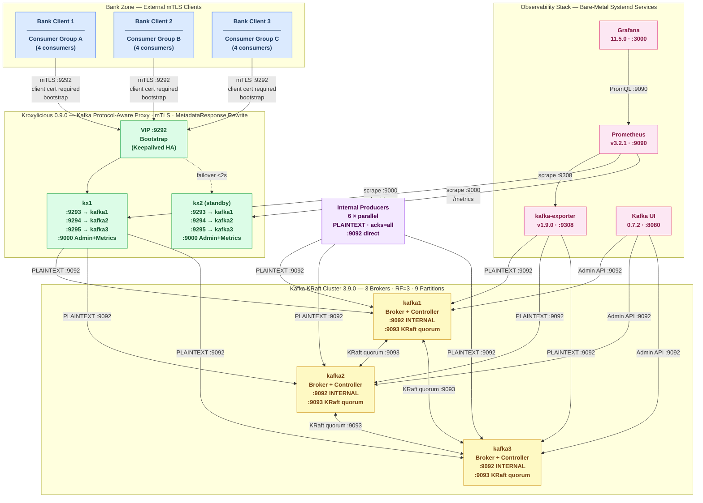
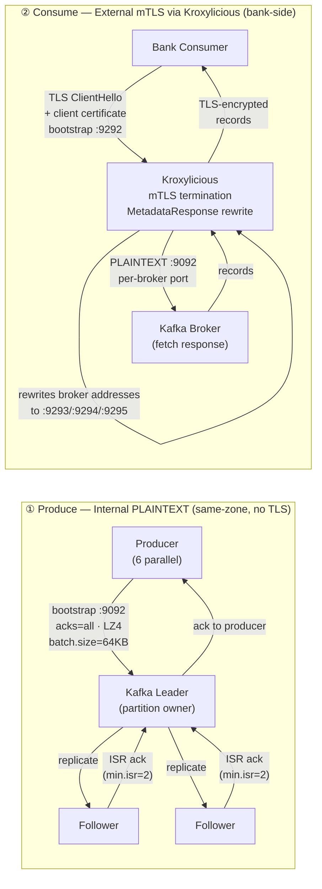
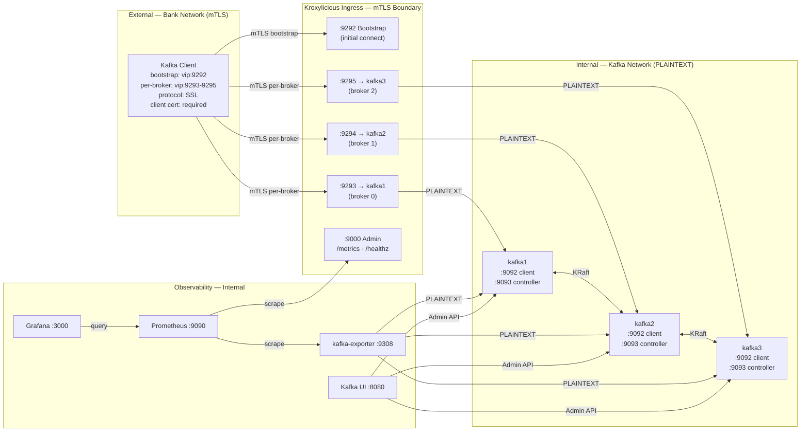
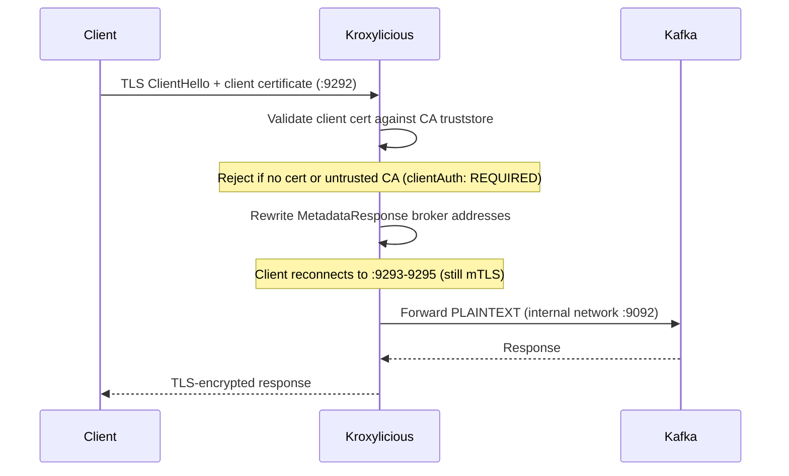
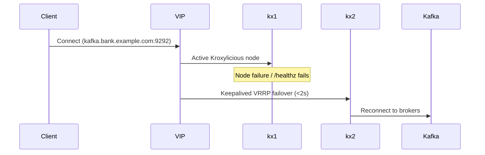

# Kafka KRaft + Kroxylicious Platform

### Production-Grade Kafka Ingress — Kafka Protocol-Aware Proxy · mTLS · HA · Full Observability · Bare Metal (Ubuntu 22/24)


---

## Platform at a Glance

| Category | Detail |
|---|---|
| **Kafka Cluster** | Apache Kafka **3.9.0** · KRaft mode (no ZooKeeper) · 3 brokers · RF=3 · combined broker+controller |
| **Proxy / Ingress** | **Kroxylicious 0.9.0** · Kafka protocol-aware · mTLS termination · `MetadataResponse` rewrite · port-per-broker routing |
| **Security** | Mutual TLS (mTLS) · client certificate required · self-signed CA · PKCS12 keystores · zero plaintext on external network |
| **High Availability** | **Keepalived** VRRP · 2-node Kroxylicious HA pair · shared VIP · health-check driven failover **< 2 seconds** |
| **Deployment** | **Bare metal** (Ubuntu 22.04 / 24.04) · **Ansible** automated · no Docker in production · 7 Ansible roles |
| **Monitoring** | Prometheus **3.2.1** · Grafana **11.5.0** (auto-provisioned dashboards) · kafka-exporter · Kafka UI |
| **Clients** | Bootstrap `:9292` (VIP) · per-broker `:9293 / :9294 / :9295` · standard Kafka client with SSL properties |
| **Reference Proxy** | Envoy v1.33 config kept in repo (`docker-compose-envoy.yml`, `roles/envoy/`) — not active in production |
| **Local Dev** | Docker Compose quickstart (`docker compose up -d`) — optional, not required |
| **CI** | GitHub Actions · bare-metal package install on runner · 14-test mTLS smoke suite · no Docker Compose |

---

## Table of Contents

* [Overview](#overview)
* [Component Versions](#component-versions)
* [Architecture](#architecture)
* [Security](#security-mtls-flow)
* [Monitoring](#monitoring)
* [High Availability](#high-availability)
* [Bare-Metal Deployment](#bare-metal-deployment)
* [Local Development (Docker Compose)](#local-development-docker-compose-optional)
* [Installation Guides](#installation-guides)
* [Operations Runbook](#operations-runbook)
* [Deployment](#deployment)
* [Validation](#validation)
* [CI/CD](#cicd)
* [Testing](#testing)
* [Scaling](#scaling)
* [Design Summary](#design-summary)

---

## Overview

This platform provides a **production-grade Kafka ingestion layer** for bank-side clients:

* **Kroxylicious** — Kafka protocol-aware proxy; terminates mTLS and rewrites `MetadataResponse` so clients transparently connect through per-broker ports. No raw broker ports exposed externally.
* mTLS authentication — client certificates required for all external connections
* KRaft mode (no ZooKeeper) — 3-node cluster with combined broker+controller roles
* Keepalived VIP failover — two Kroxylicious nodes share a single client-facing IP
* Full monitoring stack: Prometheus, Grafana dashboards, kafka-exporter, Kafka UI
* Fully on-prem, bare-metal deployment via Ansible — **no Docker required in production**
* Envoy config kept in repo for reference (`docker-compose-envoy.yml`, `config/envoy/`, `roles/envoy/`)

---

## Component Versions

All components are **latest stable open-source** releases, installed from upstream tarballs/packages:

| Component | Version | License | Role |
|---|---|---|---|
| [apache/kafka](https://kafka.apache.org/) | 3.9.0 | Apache-2.0 | 3-node KRaft broker+controller cluster |
| [kroxylicious/kroxylicious](https://kroxylicious.io/) | 0.9.0 | Apache-2.0 | Kafka protocol-aware mTLS proxy (active ingress) |
| [danielqsj/kafka-exporter](https://github.com/danielqsj/kafka_exporter) | v1.9.0 | Apache-2.0 | Kafka protocol metrics for Prometheus |
| [prom/prometheus](https://prometheus.io/) | v3.2.1 | Apache-2.0 | Metrics collection and alerting |
| [grafana/grafana](https://grafana.com/) | 11.5.0 | AGPL-3.0 | Observability dashboards |
| [provectus/kafka-ui](https://github.com/provectus/kafka-ui) | 0.7.2 | Apache-2.0 | Kafka topology browser (brokers, topics, consumer groups) |
| [envoyproxy/envoy-contrib](https://www.envoyproxy.io/) | v1.33 | Apache-2.0 | Reference proxy (kept for comparison, not active) |

---

## Architecture

### High-Level Architecture

```mermaid
flowchart TB
    subgraph BANK["External  ·  Bank Network"]
        direction LR
        BC["Bank Consumers"]
        BP["Bank Producers"]
    end

    VIP(["Keepalived VIP\nkafka.bank.example.com : 443\nActive-Passive  ·  &lt; 2 s failover"])

    subgraph ENVOY["Envoy Ingress  ·  Kafka Protocol Filter"]
        direction LR
        EA["Node 1  ●  Active\n:19092 · :19093 · :19094"]
        EB["Node 2  ○  Standby"]
    end

    subgraph KAFKA["Kafka KRaft Cluster  ·  3 Brokers  ·  RF = 3  ·  ISR ≥ 2"]
        direction LR
        K1["kafka1\nBroker + Controller"]
        K2["kafka2\nBroker + Controller"]
        K3["kafka3\nBroker + Controller"]
        K1 <-->|"KRaft"| K2
        K2 <-->|"KRaft"| K3
        K3 <-->|"KRaft"| K1
    end

    subgraph OBS["Observability"]
        direction LR
        KE["kafka-exporter\n:9308"] --> PR["Prometheus\n:9090"] --> GF["Grafana\n:3000"]
    end

    IP["Internal Producers"]

    BANK  --> VIP
    VIP   -->|"active"| EA
    VIP   -. "failover" .-> EB
    EA    --> KAFKA
    IP    --> KAFKA
    KE    --> KAFKA
    PR    --> EA

    classDef bank  fill:#dbeafe,stroke:#2563eb,color:#1e3a5f,font-weight:bold
    classDef vip   fill:#fef3c7,stroke:#d97706,color:#78350f,font-weight:bold
    classDef envoy fill:#dcfce7,stroke:#16a34a,color:#14532d,font-weight:bold
    classDef kafka fill:#fef9c3,stroke:#ca8a04,color:#713f12,font-weight:bold
    classDef obs   fill:#fce7f3,stroke:#db2777,color:#831843,font-weight:bold
    classDef side  fill:#f3e8ff,stroke:#9333ea,color:#4a044e,font-weight:bold

    class BC,BP bank
    class VIP vip
    class EA,EB envoy
    class K1,K2,K3 kafka
    class KE,PR,GF obs
    class IP side
```



### Platform Topology



### Produce & Consume Data Flow



### Network Zones & Port Reference



### Port Reference

| Port | Host | Protocol | Direction | Purpose |
|---|---|---|---|---|
| `9092` | kafka1/2/3 | PLAINTEXT | Internal | Broker client listener (producers, exporter, Kroxylicious upstream) |
| `9093` | kafka1/2/3 | PLAINTEXT | Internal | KRaft controller quorum |
| `9292` | kroxylicious (VIP) | **mTLS** | External | Bootstrap — initial bank client connection |
| `9293` | kroxylicious (VIP) | **mTLS** | External | Per-broker port → kafka1 |
| `9294` | kroxylicious (VIP) | **mTLS** | External | Per-broker port → kafka2 |
| `9295` | kroxylicious (VIP) | **mTLS** | External | Per-broker port → kafka3 |
| `9000` | kroxylicious | HTTP | Internal | Admin API — `/metrics` (Prometheus) · `/healthz` |
| `9308` | kafka-exporter | HTTP | Internal | Prometheus scrape endpoint |
| `9090` | prometheus | HTTP | Internal | Prometheus UI + query API |
| `3000` | grafana | HTTP | Internal | Grafana dashboards (`admin` / `kafka123`) |
| `8080` | kafka-ui | HTTP | Internal | Kafka topology browser |

---

## Security (mTLS Flow)



Certificates are generated by `scripts/generate-certs.sh` (OpenSSL, no Docker):

| File | Format | Purpose |
|---|---|---|
| `certs/ca.crt` | PEM | CA trust anchor — configure in client truststore |
| `certs/client.pem` | PEM | Client cert + key bundle for mTLS |
| `certs/server.p12` | PKCS12 | Kroxylicious server keystore |
| `certs/ca.p12` | PKCS12 | Kroxylicious CA truststore |

Client properties for Kafka CLI tools:

```properties
security.protocol=SSL
ssl.truststore.type=PEM
ssl.truststore.location=/path/to/certs/ca.crt
ssl.keystore.type=PEM
ssl.keystore.location=/path/to/certs/client.pem
ssl.endpoint.identification.algorithm=
```

---

## Monitoring

### Service Endpoints

| Service | URL | Purpose |
|---|---|---|
| Grafana dashboards | http://\<monitor\>:3000 | Kafka + proxy dashboards (`admin` / `kafka123`) |
| Prometheus UI | http://\<monitor\>:9090 | Metrics query + target status |
| Kroxylicious metrics | http://\<kroxylicious\>:9000/metrics | Per-cluster connection counts, JVM, Kafka protocol stats |
| kafka-exporter metrics | http://\<monitor\>:9308/metrics | Broker/topic/consumer group metrics |
| Kafka UI | http://\<monitor\>:8080 | Live topology: brokers, topics, partition leaders, consumer lag |

### Metric Pipeline

**Prometheus** scrapes two targets every 15 seconds:
- `<kroxylicious>:9000/metrics` — Kroxylicious Micrometer metrics (JVM, per-virtual-cluster connection counters, Kafka protocol request/response rates)
- `<kafka-exporter>:9308` — Kafka-native broker, topic, partition, and consumer group metrics

**kafka-exporter** connects to all 3 Kafka brokers on the internal PLAINTEXT listener (`:9092`) — no Kafka config changes needed.

**Kafka UI** queries the Kafka Admin API directly — provides a real-time topology browser with no extra metrics pipeline.

**Grafana** is auto-provisioned with dashboards and a Prometheus datasource on first start.

### Key Metrics Reference

**Kroxylicious metrics** (via `/metrics`, Micrometer/Prometheus format):

```
jvm_memory_used_bytes                     # JVM heap usage
jvm_gc_pause_seconds                      # GC activity
kroxylicious_*                            # Per-virtual-cluster connection/request counters
```

**Kafka metrics** (via kafka-exporter):

```
kafka_brokers                             # Number of brokers in the cluster
kafka_topic_partitions                    # Partition count per topic
kafka_topic_partition_current_offset      # Latest offset per partition
kafka_topic_partition_leader              # Leader broker per partition
kafka_topic_partition_under_replicated_partition  # ISR health (0 = healthy)
kafka_consumergroup_lag                   # Consumer group lag per partition
```

### Verify Monitoring is Working

```bash
# Check Prometheus scrape targets are UP
curl -s http://<monitor>:9090/api/v1/targets | python3 -m json.tool | grep '"health"'

# Query Kafka broker count
curl -s "http://<monitor>:9090/api/v1/query?query=kafka_brokers" | python3 -m json.tool

# Check Kroxylicious metrics directly
curl -s http://<kroxylicious>:9000/metrics | grep -E "kroxylicious_|jvm_memory"

# Kafka UI — open in browser
open http://<monitor>:8080
```

---

## High Availability



* Keepalived manages a VIP shared between two Kroxylicious nodes
* VRRP health check polls Kroxylicious `/healthz` — promotes standby within 2 seconds
* Kafka KRaft quorum maintains leader election independently of proxy failover
* Clients reconnect automatically (Kafka client retry handles the brief outage)

---

## Bare-Metal Deployment

### Prerequisites

| Component | Requirement |
|---|---|
| OS | Ubuntu 22.04 / 24.04 LTS (amd64) |
| Java | Temurin 21 JRE (auto-installed by Ansible roles) |
| Control node | Ansible ≥ 2.14, Python 3.10+, OpenSSL |
| Kafka nodes | 3 × dedicated servers, 8+ CPUs, 32+ GB RAM, fast SSD |
| Proxy nodes | 2 × servers for Kroxylicious HA pair |
| Monitoring node | 1 × server for Prometheus + Grafana + Kafka UI |

### Deploy

```bash
# 1. Generate TLS certificates (run once on the control node)
bash scripts/deploy-baremetal.sh --certs-only

# 2. Set the Kafka cluster ID in group_vars
#    Replace REPLACE_ME with output of:
/opt/kafka/bin/kafka-storage.sh random-uuid
# Edit: inventories/prod/group_vars/all.yml → cluster_id

# 3. Update host IPs in inventories/prod/hosts.ini

# 4. Full deployment
bash scripts/deploy-baremetal.sh

# Deploy individual layers
bash scripts/deploy-baremetal.sh --limit kafka
bash scripts/deploy-baremetal.sh --limit kroxylicious
bash scripts/deploy-baremetal.sh --limit monitoring

# Dry-run (no changes)
bash scripts/deploy-baremetal.sh --check
```

---

## Local Development (Docker Compose — Optional)

Docker Compose provides a full local stack for development and testing. **Not required for production.**

### Quick Start

```bash
# Generate TLS certificates
bash scripts/generate-certs.sh

# Start the full stack (Kafka + Kroxylicious + Prometheus + Grafana + Kafka UI)
docker compose up -d

# Or use the one-command deploy + smoke test
bash scripts/deploy-local.sh --smoke-test

# Envoy reference stack (for comparison only)
docker compose -f docker-compose-envoy.yml up -d
```

### Endpoints After Startup

| Service | Endpoint |
|---|---|
| Kafka bootstrap (via Kroxylicious mTLS) | `localhost:9292` |
| Kroxylicious per-broker ports | `localhost:9293`, `localhost:9294`, `localhost:9295` |
| Kroxylicious admin | http://localhost:9000/metrics |
| Kafka UI | http://localhost:8080 |
| Prometheus | http://localhost:9090 |
| Grafana | http://localhost:3000 (admin / kafka123) |
| kafka-exporter | http://localhost:9308/metrics |

### Teardown

```bash
bash scripts/deploy-local.sh --teardown
```

---

## Installation Guides

| Guide | Description |
|---|---|
| [Kroxylicious (Bare Metal)](docs/kroxylicious-baremetal-install.md) | Java 21, tarball install, PKCS12 certs, systemd, UFW, HA with Keepalived |
| [Kafka (KRaft Bare Metal)](docs/kafka-baremetal-install.md) | KRaft storage format, systemd service, performance tuning |
| [Envoy (Reference)](docs/envoy-baremetal-install.md) | Kept for comparison — Envoy is not the active proxy |
| [Operations Runbook](docs/operations-runbook.md) | Cert rotation, failover, health checks, day-2 ops |

---

## Deployment

```bash
# Ansible — full bare-metal deployment
bash scripts/deploy-baremetal.sh

# Or directly via ansible-playbook
ansible-playbook -i inventories/prod/hosts.ini playbooks/site.yml
```

---

## Validation

### TLS / mTLS via Kroxylicious

```bash
openssl s_client -connect <vip>:9292 \
  -cert certs/client.crt -key certs/client.key \
  -CAfile certs/ca.crt
```

### Kafka CLI (via mTLS bootstrap)

```bash
BOOTSTRAP=<vip>:9292

kafka-topics.sh \
  --bootstrap-server "$BOOTSTRAP" \
  --command-config config/kafka-ssl-client.properties \
  --list

kafka-broker-api-versions.sh \
  --bootstrap-server "$BOOTSTRAP" \
  --command-config config/kafka-ssl-client.properties
```

### KRaft Quorum Health

```bash
/opt/kafka/bin/kafka-metadata-quorum.sh \
  --bootstrap-server kafka1:9092 \
  describe --status
```

### Kroxylicious Admin

```bash
curl http://<kroxylicious>:9000/healthz
curl http://<kroxylicious>:9000/metrics | head -20
```

---

## CI/CD

GitHub Actions workflow (`.github/workflows/ci.yml`) runs on every push to `main` or `claude/**`:

| Job | Steps |
|---|---|
| **Lint** | `yamllint` all YAML configs, `ansible-lint` playbooks, `bash -n` script syntax |
| **Bare-Metal Smoke Test** | Install Temurin 21 + Kafka 3.9.0 tarball + Kroxylicious 0.9.0 directly on runner → start 3-node KRaft cluster as background processes → run 14-test smoke suite → verify Kroxylicious metrics |

CI verifies end-to-end **without Docker**:
- mTLS handshake succeeds with valid client cert
- mTLS handshake rejected without client cert
- All 3 KRaft brokers visible in cluster metadata
- Topic create / list / describe / produce / consume via Kroxylicious mTLS
- Per-broker Kroxylicious ports (9293/9294/9295) individually reachable
- KRaft controller quorum healthy
- Kroxylicious `/metrics` endpoint populated after traffic

---

## Testing

### Smoke Test (14 tests)

```bash
# Against local bare-metal install
BOOTSTRAP=<vip>:9292 \
KROXY_ADMIN_HOST=<kroxylicious-ip> \
bash scripts/kafka-smoke-test.sh

# Against local Docker Compose stack
bash scripts/kafka-smoke-test.sh   # defaults to localhost:9292
```

| # | Test |
|---|---|
| 1 | Kroxylicious admin `/healthz` reachable |
| 2 | Kroxylicious `/metrics` endpoint populated |
| 3 | mTLS handshake succeeds with valid client cert |
| 4 | Connection rejected without client cert |
| 5 | All 3 KRaft brokers visible in metadata |
| 6 | Topic creation with replication-factor=3 |
| 7 | Topic appears in listing |
| 8 | Partition leaders assigned |
| 9 | Produce 10 messages via Kroxylicious mTLS |
| 10 | Consume 10 messages via Kroxylicious mTLS |
| 11 | All 3 per-broker ports (9293/9294/9295) reachable |
| 12 | KRaft controller quorum healthy |
| 13 | Kroxylicious virtual cluster metrics populated |
| 14 | Topic deletion succeeds |

### Benchmark (6 producers · 12 consumers · mTLS)

```bash
BOOTSTRAP_INTERNAL=kafka1:9092,kafka2:9092,kafka3:9092 \
BOOTSTRAP_EXTERNAL=<vip>:9292 \
KROXY_ADMIN_HOST=<kroxylicious-ip> \
bash scripts/benchmark.sh
```

Results written to `benchmarks/benchmark-<timestamp>.md`.

---

## Scaling

| Action | Steps |
|---|---|
| Add Kafka broker | Add node to `[kafka]` inventory group; update `controller.quorum.voters`; update `numberOfBrokerPorts` in Kroxylicious config |
| Add Kroxylicious node | Add node to `[kroxylicious]` inventory group; update Keepalived config |
| Add monitoring node | Add to `[monitoring]` group; update Prometheus scrape targets in group_vars |
| Scale consumers | Add consumer instances to existing group — Kafka rebalances partitions automatically |

---

## Design Summary

| Capability | Implementation | Notes |
|---|---|---|
| Kafka Protocol Awareness | Kroxylicious 0.9.0 | Rewrites MetadataResponse; clients stay on proxy |
| Single Endpoint (HA) | Kroxylicious + Keepalived VIP | Bootstrap :9292, per-broker :9293-9295 |
| Security | mTLS (clientAuth: REQUIRED) | PKCS12 keystores; CA-signed client certs |
| Observability | Prometheus + Grafana + kafka-exporter + Kafka UI | Auto-provisioned dashboards |
| HA Failover | Keepalived VRRP | <2s failover; /healthz health check |
| Deployment | Bare Metal — Ansible | No Docker in production |
| Local Dev / CI | Docker Compose (optional) | `docker compose up -d` |
| Reference Proxy | Envoy v1.33 | Kept in repo; `docker-compose-envoy.yml` |
| Automation | Ansible roles (7 roles) | kafka_kraft, kroxylicious, prometheus, grafana, kafka_exporter, kafka_ui, pki, keepalived |

---

## Repository Structure

```
roles/
  kafka_kraft/        # Kafka 3.9.0 — tarball, KRaft format, systemd
  kroxylicious/       # Kroxylicious 0.9.0 — Java 21, PKCS12, systemd
  prometheus/         # Prometheus 3.2.1 — tarball, scrape config, systemd
  grafana/            # Grafana 11.5.0 — APT, provisioning, dashboards
  kafka_exporter/     # kafka-exporter 1.9.0 — Go binary, systemd
  kafka_ui/           # Kafka UI 0.7.2 — JAR, Java 21, systemd
  pki/                # TLS certificate distribution
  keepalived/         # Keepalived VRRP — VIP + health check
  envoy/              # Envoy v1.33 (reference only)

config/
  kroxylicious/kroxylicious.yaml   # Docker Compose proxy config
  prometheus/prometheus.yml        # Docker Compose scrape config (bare-metal: Ansible template)
  grafana/provisioning/            # Datasource + dashboard provisioning
  grafana/dashboards/              # Pre-built Grafana dashboard JSON
  envoy/envoy.yaml                 # Envoy reference config (not active)

scripts/
  generate-certs.sh        # OpenSSL — CA, server PKCS12, client PEM
  deploy-baremetal.sh      # Ansible-based bare-metal deploy (primary)
  deploy-local.sh          # Docker Compose deploy (development only)
  kafka-smoke-test.sh      # 14-test suite — uses local Kafka CLI, no Docker
  benchmark.sh             # 6 producers + 12 consumers mTLS benchmark

docs/
  kroxylicious-baremetal-install.md   # Full install guide (Java 21, systemd, HA)
  kafka-baremetal-install.md          # Kafka KRaft bare-metal guide
  envoy-baremetal-install.md          # Envoy reference guide
  operations-runbook.md               # Day-2 ops (cert rotation, failover)

docker-compose.yml          # Docker quickstart (Kroxylicious-based)
docker-compose-envoy.yml    # Docker reference stack (Envoy-based)
```

---

## Next Steps

* Implement DR (multi-DC Kafka MirrorMaker2)
* Add per-client-certificate-CN rate limiting in Kroxylicious filter
* Add Prometheus AlertManager rules (consumer lag, ISR, broker down)
* Add consumer group lag alerting threshold in Grafana
* Add OpenTelemetry tracing via Kroxylicious OTLP export
