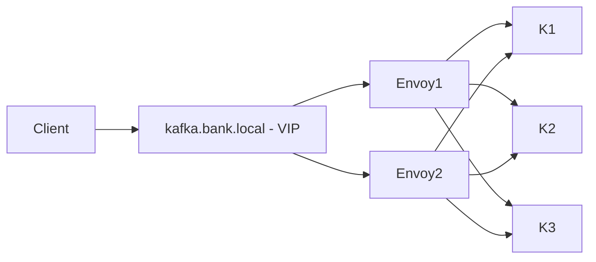
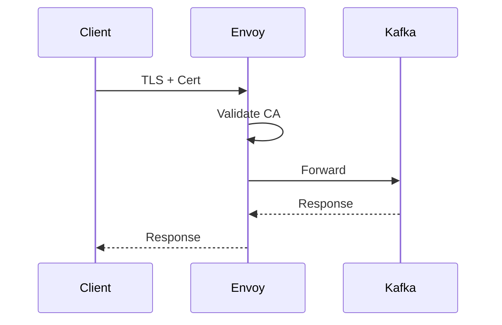
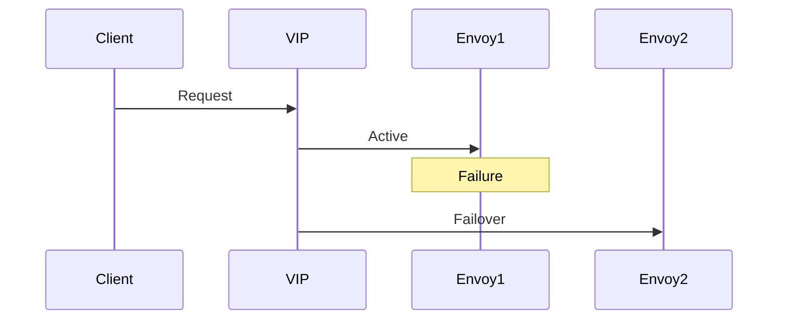

# 🚀 Kafka KRaft + Envoy Platform

### Secure Single-Endpoint Kafka (mTLS + HA) — Bare Metal (Ubuntu 22/24)


---

## 📑 Table of Contents

* [Overview](#-overview)
* [Architecture](#-architecture)
* [Security](#-security-mtls-flow)
* [High Availability](#-high-availability)
* [Bare-Metal Deployment](#-bare-metal-deployment)
* [Installation Guides](#-installation-guides)
* [Operations Runbook](#-operations-runbook)
* [Deployment](#-deployment)
* [Validation](#-validation)
* [CI/CD](#-cicd)
* [Testing](#-testing)
* [Scaling](#-scaling)

---

## 🚀 Overview

This platform provides a **bank-grade Kafka ingestion layer**:

* Single endpoint (`:443`)
* mTLS authentication
* Envoy Kafka proxy
* Keepalived VIP failover
* Fully on-prem, bare-metal deployment

---

## 🧱 Architecture



---

## 🔐 Security (mTLS Flow)



---

## 🔁 High Availability



---

# 🖥️ Bare-Metal Deployment

This platform is designed for:

* Ubuntu 22.04 / 24.04
* Physical servers (no containers in production)
* Dedicated Kafka nodes
* Envoy + Keepalived ingress

---

# 📦 Installation Guides

## 🔹 Envoy (Bare Metal)

👉 [Envoy Installation Guide](docs/envoy-baremetal-install.md)

Covers:

* Envoy installation (APT)
* TLS setup (mTLS)
* systemd service
* Validation & troubleshooting

---

## 🔹 Kafka (KRaft Bare Metal)

👉 [Kafka Installation Guide](docs/kafka-baremetal-install.md)

Covers:

* Kafka setup (KRaft mode)
* Storage initialization
* systemd service
* Performance best practices

---

# 🛠️ Operations Runbook

👉 [Operations Runbook](docs/operations-runbook.md)

Includes:

* Incident handling
* Failover procedures
* TLS debugging
* Health checks
* Smoke testing

---

# 🚀 Deployment

```bash id="deploy01"
ansible-playbook -i inventories/prod/hosts.ini playbooks/site.yml
```

---

# 🧪 Validation

### TLS

```bash id="val01"
openssl s_client -connect kafka.bank.local:443
```

### Kafka

```bash id="val02"
kafka-topics.sh --list
```

---

# 🔁 CI/CD

```text id="ci01"
.github/workflows/deploy-staging.yml
```

* Deploy to staging
* Run smoke tests
* Upload reports

---

# 🧪 Testing

## Smoke Test

```bash id="test01"
./scripts/kafka-smoke-test.sh kafka.bank.local:443
```

## Load Test

```bash id="test02"
kafka-producer-perf-test.sh ...
```

## Chaos Test

```bash id="test03"
./scripts/chaos.sh latency
```

---

# 📈 Scaling

* Add brokers → update Envoy → reload
* Add Envoy → update Keepalived

---

# 🧭 Design Summary

| Capability      | Implementation |
| --------------- | -------------- |
| Single Endpoint | Envoy + VIP    |
| Security        | mTLS           |
| HA              | Keepalived     |
| Deployment      | Bare Metal     |
| Automation      | Ansible        |

---

# 📄 Documentation Structure

```text id="doc01"
docs/
  envoy-baremetal-install.md
  kafka-baremetal-install.md
  operations-runbook.md
```

---

# 🚀 Next Steps

* Add monitoring dashboards
* Implement DR (multi-DC Kafka)
* Add rate limiting per bank

---
